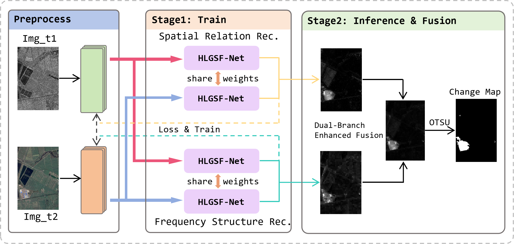
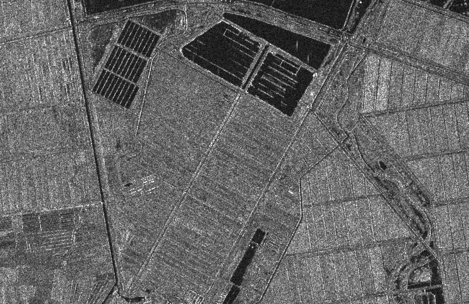
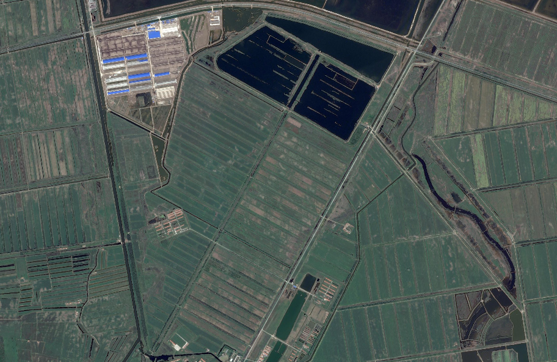
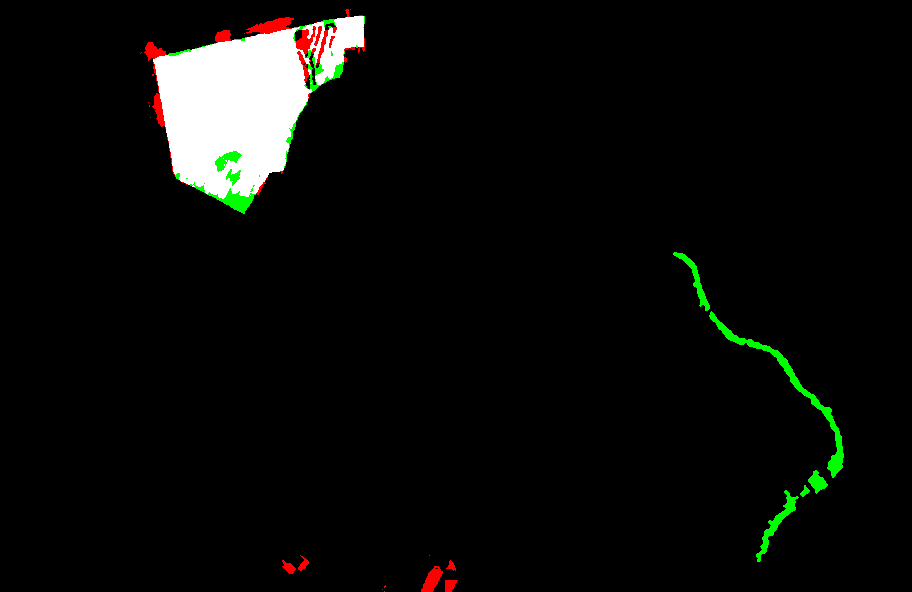

# HLGSG-Net

> A Multi-Modal Remote Sensing Image Change Detection Approach — Under Revision and Paper Writing

## Overview

This project investigates change detection in multi-modal remote sensing imagery, with a focus on semantic-guided feature integration and spatial-frequency dual-domain reconstruction. Currently, the work is in the phase of model refinement, experimental validation, and paper preparation.

The overall pipeline of the proposed method is illustrated below:

  

## Progress

- Main framework established with preliminary experimental results
- Ongoing refinement of architectural details and comparative evaluations
- Paper drafting in parallel with experimental improvements

## Visualization Results

Sample detection outputs are available under the `results/` directory. Each input image is displayed side-by-side with its corresponding change detection map for direct visual comparison.

  
  
  

